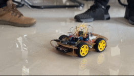
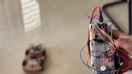

# Bluetooth Controlled Robot Car (Arduino + ESP32)

This project allows you to control a 4-wheel drive robot car using an **Arduino Uno** and **ESP32**. The robot receives movement commands over Bluetooth from a master device and sends it to the slave device that is the robot then responds accordingly.

## Project Demo

### Button Mode
    


### Gyro Mode



## How It Works

1. The ESP32 with MPU6050 connects to Arduino with HC-05 for communication.
2. Default mode is Button Mode in which you can send commands to the robot to move it.
3. The mode can be switched to the Gyro Mode using the mode button. (holding for 2 seconds to switch modes).
4. When in Gyro Mode, a `STOP` postion is initialized ,that is the positon in which the master device is switched on. It can be changed by holding the mode button for 2 seconds. 
5. - Moving the remote from `STOP` towards the ground with the nose facing downwards, sends to command `FORWARD` and vice-versa for `BACKWARD`.

    - Tilting the remote from `STOP` to left sends the command `LEFT` and vice versa for `RIGHT`. 
    - The diagonal directions can be used by doing a `FORWARD` or `BACKWARD` motion or button press followed by tilting either `LEFT` or `RIGHT` to get the desired the diagonal direction.
        >- **Note**:  There is a timeout in reading the combo direction detected by MPU6050, which can be changed in the [configuration section](##-Configuration).

6. The HC-05 Bluetooth module receives a command like `FORWARD`, `LEFT`, `STOP`, etc. from the Remote/Controller.
7. The Arduino reads the command via `SoftwareSerial`.
8. Based on the command, it sets the motor driver (L298N) pins HIGH/LOW and PWM speeds.
9. The robot moves accordingly.


## Features

- Bluetooth-controlled movement via HC-05
- Basic directions: `FORWARD`, `BACKWARD`, `LEFT`, `RIGHT`
- Diagonal movement: `FORWARD LEFT`, `FORWARD RIGHT`, `BACKWARD LEFT`, `BACKWARD RIGHT`
- Smooth control using PWM (speed control)
- Immediate `STOP` command support
- Button mode to switch between button mode and gyro mode

## Hardware Used

- Arduino Uno (or compatible board)
- ESP32 
- L298N motor driver
- HC-05 Bluetooth module
- MPU6050 (6 Axis Gyroscope and Accelerometer)
- 5 Push Buttons
- 4x DC motors
- Power supply (battery pack or external power for motors; `Recommended: 9-15V`)
- Jumper wires

##  Arduino Libraries Required

- `SoftwareSerial` (Built-in with Arduino)
- `Wire.h` (Built-in with esp32 boards)
- `BluetoothSerial.h`

## Wiring Diagram

### <u>For Master (ESP32 with MPU6050 and Buttons)</u>

#### MPU6050 Gyroscope and Accelerometer

| MPU6050   | ESP32 Pins  |
|-----------|-------------|
| VCC       | 3.3V        |
| GND       | GND         |
| SCL       | GPIO22      |
| SDA       | GPIO21      |

#### Push Buttons

| Buttons | ESP32 Pin |
|-----------|------------|
| Button1 (Mode Button)| GPIO 18 |
| Button2 (Forward)| GPIO 4|
| Button3 (Backward)| GPIO 5      | 
| Button4 (Left)| GPIO 23       |
| Button5 (Right)| GPIO 19 |

### <u>For Slave (Arduino Uno with HC-05 and Motor Driver)</u>

#### HC-05 Bluetooth Module

| HC-05 Pin | Arduino Pin |
|-----------|-------------|
| TX        | D10 (Software RX) |
| RX        | D11 (Software TX) |
| VCC       | 5V         |
| GND       | GND        |

> **Note:** Use a voltage divider (1kΩ + 2kΩ or any combinations that gives ~3.3V) on HC-05 RX pin to drop Arduino's 5V TX to 3.3V safe level.

#### L298N Motor Driver

| L298N Pin | Arduino Pin | Function            |
|----------|-------------|---------------------|
| IN1      | D2          | Left motor direction |
| IN2      | D3          | Left motor direction |
| IN3      | D4          | Right motor direction |
| IN4      | D5          | Right motor direction |
| ENA      | D6 (PWM)    | Left motor speed     |
| ENB      | D9 (PWM)    | Right motor speed    |
| VCC      | Motor power |
| GND      | GND         |
| 5V (out) | Optional    |


## Bluetooth Commands

Send any of the following commands from the Master device using any of the modes(Button mode or Gyro Mode):

| Command          | Action             |
|------------------|--------------------|
| `FORWARD`        | Move forward       |
| `BACKWARD`       | Move backward      |
| `LEFT`           | Turn left          |
| `RIGHT`          | Turn right         |
| `FORWARD LEFT`   | Forward + turn left |
| `FORWARD RIGHT`  | Forward + turn right |
| `BACKWARD LEFT`  | Backward + turn left |
| `BACKWARD RIGHT` | Backward + turn right |
| `STOP`           | Stop all motion    |

## Configuration

In the robot sketch:

- Adjust speed values:
  ```cpp
  const int SPEED_LEFT = 200;
  const int SPEED_RIGHT = 200;
  ```

In the master sketch:

- Adjust timeout values:
  ```cpp
  const unsigned long comboWindow = 400;
  ```

## <b>Troubleshooting</b>

- If it shows an error with the "SetPin" line in the master.ino then remove that line and upload again. If the issue persists then try the next step.
- `You might have to downgrade your esp32 board to 2.0.6 or less for the board to connect the HC-05 in the slave device.`

